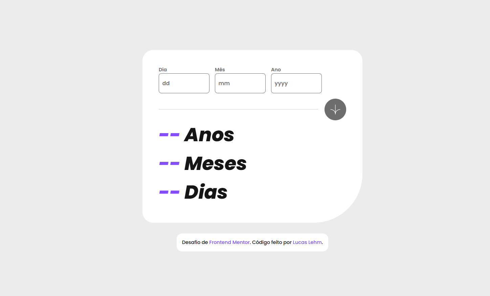

# 📅 "Age Calculator App"

Este projeto é uma solução para o desafio **[Age Calculator App](https://www.frontendmentor.io/challenges/age-calculator-app-dF9DFFpj-Q)** do Frontend Mentor.  
O objetivo era construir um aplicativo que calcula a idade de uma pessoa com base na data de nascimento informada, exibindo o resultado em **anos, meses e dias**.

---

## 🚀 Demo

🔗 [Clique aqui para ver o projeto online](https://age-calculator-app-phi-ten.vercel.app/)

---

## 🖼️ Preview

---

## 📌 Funcionalidades

- ✅ Validação de datas (dia, mês e ano)  
- ✅ Mensagens de erro amigáveis em caso de entradas inválidas  
- ✅ Botão de calcular só é habilitado quando a data é válida  
- ✅ Cálculo preciso de idade em **anos, meses e dias**  
- ✅ Animação no contador do resultado  
- ✅ Layout responsivo para diferentes tamanhos de tela  

---

## 🛠️ Tecnologias Utilizadas

- **HTML5**  
- **CSS3 (Flexbox + Responsividade)**  
- **JavaScript (manipulação do DOM, validações e cálculos)**  
- **Google Fonts (Poppins)**  
- **Deploy na Vercel**  

---

## 📚 Aprendizados

- Estruturar melhor o código JavaScript usando objetos para organizar seletores.
- Implementar validações personalizadas de formulários.
- Trabalhar com cálculos de data (incluindo anos bissextos e meses diferentes).
- Aplicar animações simples para deixar a UI mais dinâmica.

## 🙌 Agradecimentos

- Desafio disponibilizado por [FrontEnd Mentor](https://www.frontendmentor.io/home)
- Projeto desenvolvido por [Lucas Lehm](https://github.com/lucaslehm). 🚀